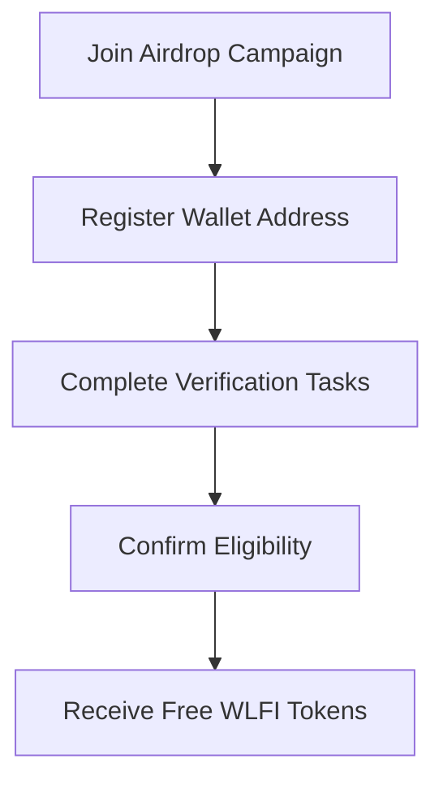

# WLFI Airdrop – Complete Guide to Participation

Quick Links: [Overview](#overview) · [Benefits](#benefits) · [Distribution](#token-distribution) · [Eligibility](#eligibility) · [How to Participate](#how-to-participate) · [FAQ](#faq)

---

## Overview

The **WLFI Airdrop** is an official community growth initiative designed to reward early supporters and participants with free WLFI tokens. By joining the campaign, users gain access to exclusive features, potential ecosystem perks, and an early stake in the project’s long-term vision.

> \[!IMPORTANT]
> Participating in the WLFI Airdrop is free. No upfront payment or hidden activation is required.

---

## Benefits

* **Free Tokens** – Earn WLFI without cost.
* **Early Access** – Be among the first to enter the ecosystem.
* **Community Growth** – Support project adoption and receive rewards.
* **Secure Participation** – Fully verified and trusted process.

---

## Token Distribution

The WLFI Airdrop allocates tokens to encourage fairness and community engagement.

| Distribution Category | Percentage | Notes                          |
| --------------------- | ---------- | ------------------------------ |
| Community Airdrop     | 40%        | Free tokens for eligible users |
| Partnerships & Growth | 25%        | Exchanges, integrations        |
| Development Fund      | 20%        | Ongoing project upgrades       |
| Team & Advisors       | 15%        | Locked with vesting            |

*Accessibility note: Table values are simplified for quick reading.*

---

## Eligibility

To join the WLFI Airdrop, users must:

* Hold a valid crypto wallet (ETH/BSC compatible).
* Complete basic verification tasks (social media follow, share, or form submission).
* Agree to the project’s participation rules.

> \[!NOTE]
> Eligibility rules may vary slightly by region and platform. Always check official announcements.

---

## How to Participate

Follow these steps to claim WLFI tokens:

1. **Register** – Sign up via the official WLFI Airdrop portal.
2. **Connect Wallet** – Use MetaMask, Trust Wallet, or any supported wallet.
3. **Complete Tasks** – Follow social media, share content, or invite friends.
4. **Submit** – Finalize your details to confirm entry.
5. **Claim Tokens** – WLFI will be distributed to your wallet after the campaign closes.

---

## Integrations & Ecosystem

WLFI tokens are designed for integration with:

* **DEX/CEX Trading** – Seamless liquidity on major platforms.
* **Staking Programs** – Earn more rewards by locking tokens.
* **Governance Participation** – Vote on key ecosystem upgrades.

---

## FAQ

**Q1: Is the WLFI Airdrop really free?**
Yes, participation requires no payment. You only need to follow steps and meet eligibility.

**Q2: How many tokens can I earn?**
The allocation depends on campaign rules and task completion.

**Q3: When will tokens be distributed?**
After the official campaign ends, tokens are distributed to verified wallets.

**Q4: Is it safe?**
Yes. The WLFI Airdrop uses verified wallet connections and secure distribution methods.

---

## Final Call to Action

The **WLFI Airdrop** is your chance to secure free tokens, support the project’s vision, and become part of a growing crypto community. Don’t miss this opportunity to participate early and enjoy full benefits.

---
